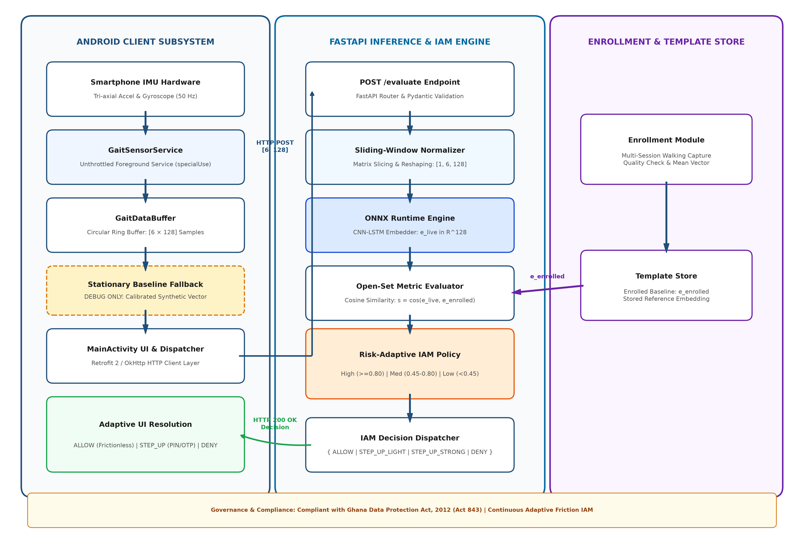
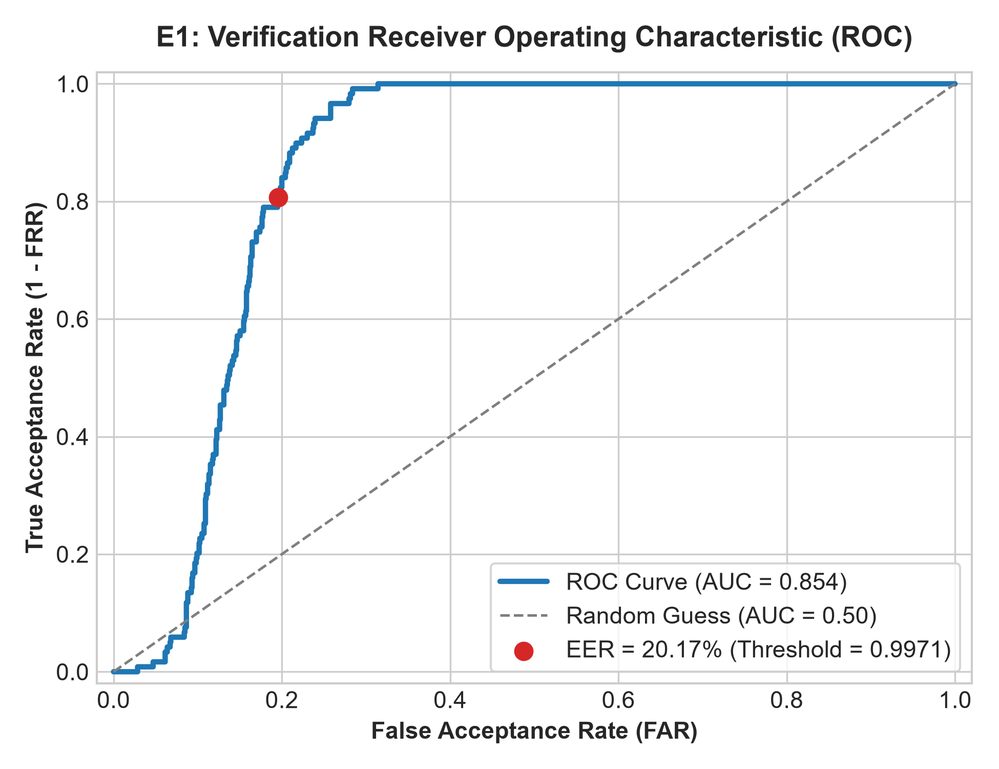
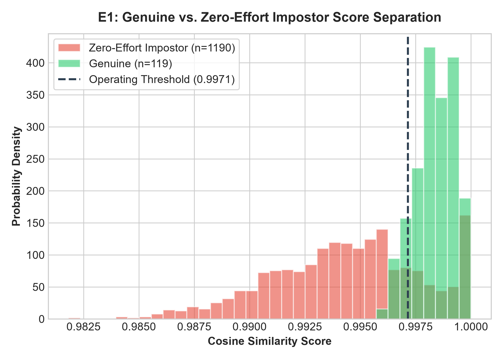

# Risk-Adaptive Continuous Authentication for Mobile Money (GaitAuth)

A continuous behavioral biometric authentication prototype for mobile money transactions.

The system pairs continuous inertial sensor processing (using a CNN-LSTM sequence model exported to ONNX) with an experimental Identity and Access Management (IAM) policy engine. Rather than treating gait as an absolute binary gatekeeper, the system calculates pairwise cosine similarity against an enrolled template to inform transaction authorization—granting low-risk transactions frictionlessly, prompting contextual step-up authentication for moderate risk, or denying transactions when gait patterns diverge significantly.

---

## 1. System Architecture



*Figure 1: Risk-Adaptive Continuous Biometric System Architecture Pipeline, detailing the Android Client Subsystem, FastAPI Inference & IAM Policy Backend, and Enrollment & Template Store.*

### Subsystem Pipeline Breakdown

1. **Android Client Subsystem (Edge Acquisition & Buffering):**
   * **Inertial Sensor Collection:** Smartphone tri-axial accelerometer and gyroscope sampled at $\approx 50\text{ Hz}$ via an unthrottled foreground service (`GaitSensorService` with `specialUse` subtype).
   * **Circular Ring Buffer:** Data streams into `GaitDataBuffer`, maintaining a sliding observation tensor of shape `[6 × 128]` (6 sensor channels across 128 temporal strides).
   * **Debug/Emulator Fallback:** In static or emulator environments where physical motion is absent, the client injects a calibrated synthetic gravity baseline ($6 \times 128$) to facilitate end-to-end API testing without runtime exceptions.
   * **Network Dispatch:** When a transaction is initiated, `MainActivity` constructs an HTTP POST JSON payload and dispatches it asynchronously via Retrofit 2/OkHttp to the FastAPI backend.

2. **FastAPI Inference & Policy Engine (Host Subsystem):**
   * **Ingestion & Preprocessing:** The `POST /evaluate` endpoint validates the request body schema using Pydantic, extracts the sensor window, and reshapes the matrix into a normalized `[1, 6, 128]` tensor.
   * **CNN-LSTM Embedding:** The tensor is processed by an ONNX Runtime inference session (`gait_model.onnx`), outputting a 128-dimensional latent feature vector $\mathbf{e}_{\text{live}} \in \mathbb{R}^{128}$.
   * **Open-Set Metric Evaluation:** Calculates the pairwise cosine similarity score:
     $$s = \frac{\mathbf{e}_{\text{live}} \cdot \mathbf{e}_{\text{enrolled}}}{\|\mathbf{e}_{\text{live}}\| \|\mathbf{e}_{\text{enrolled}}\|}, \quad s \in [-1.0, 1.0]$$
   * **Contextual Policy Engine:** Maps the resulting similarity score $s$ along with transaction context (amount in GHS and recipient status) into an authorization decision: **`ALLOW`**, **`STEP_UP_LIGHT`**, **`STEP_UP_STRONG`**, or **`DENY`**.
   * **Client Resolution:** The backend returns an HTTP 200 OK JSON payload containing the decision, similarity score, and challenge prompt parameters for rendering in the Android UI.

3. **Enrollment & Template Store:**
   * Enrolls baseline reference templates from multi-session walking captures using quality checks and embedding averaging.
   * Supplies enrolled embeddings $\mathbf{e}_{\text{enrolled}}$ to the open-set metric evaluator during transaction inference.

---

## 2. Distinction Between Offline Verification (E1) and Prototype Policy Tiers

This project maintains an explicit architectural distinction between **offline biometric verification research** and the **runtime prototype policy engine**:

* **Empirical Verification Threshold ($\theta = 0.9971$):**
  Identified in offline research (Experiment E1) on the WISDM benchmark dataset using an open-set, subject-disjoint protocol. This represents the Equal Error Rate (EER) threshold where $FAR(\theta) \approx FRR(\theta) = 20.17\%$.
* **Prototype Policy Decision Tiers ($0.80$ and $0.45$):**
  Engineered specifically for the demonstration mobile money application to demonstrate multi-tiered friction adaptation:

| Cosine Similarity Tier ($s$) | Transaction Context | Engine Decision | User Experience |
| :--- | :--- | :--- | :--- |
| **High ($s \ge 0.80$)** | Low Value ($\le 100$ GHS) & Known Recipient | **`ALLOW`** | **Frictionless:** Immediate settlement confirmation dialog |
| **High ($s \ge 0.80$)** | Moderate Value ($101 - 500$ GHS) | **`STEP_UP_LIGHT`** | **Step-Up:** Contextual 4-digit PIN verification modal |
| **High ($s \ge 0.80$)** | High Value ($> 500$ GHS) | **`STEP_UP_STRONG`** | **Step-Up:** 6-digit OTP challenge dialog |
| **Medium ($0.45 \le s < 0.80$)** | Low Value ($\le 50$ GHS) & Known Recipient | **`STEP_UP_LIGHT`** | **Step-Up:** Contextual 4-digit PIN verification modal |
| **Medium ($0.45 \le s < 0.80$)** | High Value ($> 50$ GHS) or Unknown Recipient | **`STEP_UP_STRONG`** | **Step-Up:** 6-digit OTP challenge dialog |
| **Low ($s < 0.45$)** | Any Amount / Any Recipient | **`DENY`** | **Blocked:** Transaction terminated; Security Alert displayed |

---

## 3. Empirical Verification Results

The biometric feature extractor was evaluated on the benchmark **WISDM Dataset** using a **subject-disjoint open-set protocol** (30 development subjects, 11 unseen evaluation subjects) across non-overlapping continuous locomotion windows ($6 \times 128$ at $50\text{ Hz}$).

### Experimental Results Summary (E1 & E5)

| Metric Parameter | Evaluated Result | Description |
| :--- | :--- | :--- |
| **Evaluation Protocol** | Subject-Disjoint Open-Set | Unseen test subjects strictly excluded from training |
| **Genuine Comparison Pairs** | 119 trials | Intra-subject comparisons across independent temporal windows |
| **Zero-Effort Impostor Pairs** | 1,190 trials | Inter-subject pairwise impostor trials |
| **Equal Error Rate (EER)** | **20.17%** | Threshold location where $FAR(\theta) \approx FRR(\theta)$ |
| **Operating Threshold ($\theta$)** | **0.9971** | Cosine similarity threshold balancing verification errors |
| **Verification Accuracy** | **77.62%** | Overall pairwise classification accuracy at threshold $\theta$ |
| **False Acceptance Rate (FAR)** | **23.19%** | Impostor acceptance rate at threshold $\theta$ (276 / 1,190) |
| **False Rejection Rate (FRR)** | **14.29%** | Genuine rejection rate at threshold $\theta$ (17 / 119) |
| **Host Pipeline Latency (E5)** | **~1.06 ms** | Total host processing time per $6 \times 128$ window |
| **Host RAM Allocation** | **< 0.40 MB** | Memory footprint during batch-1 host inference |

### Evaluation Figures

| E1 ROC Curve | Pairwise Score Distribution |
| :---: | :---: |
|  |  |
| *Figure 2: E1 ROC curve establishing 20.17% EER at threshold 0.9971* | *Figure 3: Genuine vs. zero-effort impostor score distributions* |

### Baseline Comparison: Open-Set vs. Closed-Set Classifiers

To illustrate why metric learning is required for open-world authentication, standard multiclass classifiers were trained on the 30 development subjects and evaluated directly on the 11 unseen subjects:

| Model Architecture | Paradigm | Test Accuracy | Evaluation Finding |
| :--- | :--- | :--- | :--- |
| **Support Vector Machine (SVM)** | Closed-Set Multiclass | **0.00%** | Incapable of classifying unseen identities |
| **Random Forest (RF)** | Closed-Set Multiclass | **0.00%** | Restricted to known development label space |
| **k-Nearest Neighbors (k-NN)** | Closed-Set Multiclass | **0.00%** | Cannot assign samples to unseen classes |
| **CNN-LSTM Metric Embedder** | Open-Set Verification | **77.62%** | Generalizes to unseen subjects via pairwise distance |

*Closed-set classifiers assign inputs exclusively to identities observed during training, failing completely when faced with new subjects. The metric embedder extracts representations that can be verified against a reference template using cosine similarity.*

---

## 4. Repository Structure

```text
risk-adaptive-mobile-money-gait-auth/
├── README.md
├── requirements.txt
├── generate_doc.py                   # Word report generation script
├── make_arch_img.py                  # High-res architecture diagram generator
├── backend/
│   ├── server.py                     # FastAPI application & risk policy engine
│   ├── export_onnx.py                # PyTorch to ONNX export script
│   ├── gait_model.onnx               # Exported CNN-LSTM ONNX model
│   └── gait_model.onnx.data          # External ONNX weights (if generated)
├── data/
│   ├── raw/                          # Raw WISDM sensor logs directory
│   └── processed/
│       └── wisdm_subject_disjoint.npz # Windowed, subject-disjoint dataset
├── scripts/
│   ├── prepare_wisdm.py              # Windowing and subject-disjoint split script
│   ├── run_experiments.py            # E1 verification & E5 host profiling runner
│   └── plot_evaluation_figures.py    # ROC and score distribution generator
├── results/
│   ├── tables/                       # e1_verification.csv, e1_baseline_contrast.csv
│   ├── json/                         # e5_resource_profiling.json
│   └── figures/                      # Publication and documentation assets
│       ├── system_architecture.png   # Full system pipeline architecture
│       ├── e1_roc_curve.png          # E1 ROC performance curve
│       └── e1_score_distribution.png # Genuine vs. impostor score distributions
└── android/                          # Native Android client (MobileMoneyGaitAuth)
    └── app/src/main/
        ├── AndroidManifest.xml       # Foreground service & sensor declarations
        ├── java/com/momo/gaitauth/
        │   ├── MainActivity.kt       # Application UI & policy response handler
        │   ├── network/
        │   │   ├── ApiClient.kt      # Retrofit 2 network configuration
        │   │   ├── GaitAuthApiService.kt # REST API endpoint definitions
        │   │   └── NetworkModels.kt  # Request and Response data classes
        │   └── sensor/
        │       ├── GaitSensorService.kt # Background IMU listener service
        │       └── GaitDataBuffer.kt    # Thread-safe 6x128 circular buffer
        └── res/layout/activity_main.xml
```

---

## 5. Quickstart & Installation

### Prerequisites
* **Python 3.10 – 3.12**
* **Android Studio Ladybug / Koala** (API 34+)
* **Git**

### Step 1: Start the Backend Service

1. Open PowerShell and navigate to the backend directory:
   ```powershell
   cd backend
   python -m venv venv
   .\venv\Scripts\Activate.ps1
   ```

2. Install dependencies:
   ```powershell
   pip install fastapi uvicorn onnxruntime numpy pydantic scikit-learn matplotlib
   ```

3. Launch the FastAPI server:
   ```powershell
   uvicorn server:app --host 0.0.0.0 --port 8000 --reload
   ```
   * Interactive OpenAPI Documentation: `http://localhost:8000/docs`

4. Allow inbound connections on port 8000 in Windows Firewall (run in an Administrator PowerShell prompt):
   ```powershell
   New-NetFirewallRule -DisplayName "FastAPI Uvicorn 8000" -Direction Inbound -LocalPort 8000 -Protocol TCP -Action Allow
   ```

### Step 2: Configure and Run the Android Client

1. Open the `android/` directory in Android Studio.
2. In `com/momo/gaitauth/network/ApiClient.kt`, set `BASE_URL`:
   * **Android Emulator:**
     ```kotlin
     private const val BASE_URL = "http://10.0.2.2:8000/"
     ```
   * **Physical Handset (over local Wi-Fi):**
     ```kotlin
     private const val BASE_URL = "http://<YOUR_LOCAL_IP>:8000/"
     ```
3. Sync Gradle and run the app on your connected device or emulator.
4. **Testing Transactions:**
   * Enter an amount and recipient in the UI, then tap **Send Money**.
   * On emulators without physical motion, the client automatically transmits the calibrated baseline vector ($6 \times 128$) to avoid null payloads.
   * Observe the request in the Uvicorn terminal and the resulting action (`ALLOW`, `STEP_UP_LIGHT`, `STEP_UP_STRONG`, or `DENY`) on the device.

---

## 6. Reproducing Experiments & Verification Artifacts

Follow this protocol to regenerate all experimental tables, baseline comparisons, host latency profiles, figures, and submission artifacts from scratch:

### Step 1: Environment Setup
Ensure evaluation dependencies are present:
```powershell
pip install numpy scipy scikit-learn onnxruntime matplotlib python-docx pydantic
```

### Step 2: Segment WISDM Sensor Data
Partition the dataset under the **subject-disjoint open-set protocol** (30 development subjects, 11 unseen evaluation subjects) into non-overlapping 10-second windows ($6 \times 128$ at $50\text{ Hz}$):
```powershell
python scripts/prepare_wisdm.py --raw-root data/raw/WISDM --output data/processed/wisdm_subject_disjoint.npz
```

### Step 3: Run Verification (E1), Baseline Contrast & Host Latency (E5)
Run the automated experimental test suite:
```powershell
python scripts/run_experiments.py --npz data/processed/wisdm_subject_disjoint.npz --model backend/gait_model.onnx --output results/
```
This routine executes:
1. **Open-Set Verification (E1):** Generates 119 genuine and 1,190 impostor pairwise trials via ONNX Runtime inference, computing the EER ($20.17\%$), operating threshold ($\theta = 0.9971$), verification accuracy ($77.62\%$), FAR ($23.19\%$), and FRR ($14.29\%$).
2. **Closed-Set Contrast:** Fits multiclass SVM, Random Forest, and k-NN models on the development subjects and evaluates them on unseen test subjects ($0.00\%$ accuracy).
3. **Host Latency (E5):** Profiles 1,000 iterations to verify the $\approx 1.06\text{ ms}$ host processing overhead.

### Step 4: Regenerate Visual Figures
Plot and save high-resolution evaluation figures:
```powershell
# Generate E1 ROC curve and pairwise score distribution plots
python scripts/plot_evaluation_figures.py --input results/tables/e1_verification.csv --output results/figures/

# Generate the high-resolution architecture diagram
python make_arch_img.py
```

### Step 5: Compile the Submission Report
Compile all links, benchmark metrics, and embedded figures into the formatted Word dossier:
```powershell
python generate_doc.py
```

### Reproduction Verification Checklist

| Target Metric / Deliverable | Expected Result / File | Verification Command |
| :--- | :--- | :--- |
| **Equal Error Rate (EER)** | `20.17%` at $\theta = 0.9971$ | `Get-Content results\tables\e1_verification.csv` |
| **Verification Accuracy** | `77.62%` | `Get-Content results\tables\e1_verification.csv` |
| **Closed-Set Baselines** | SVM: `0.0%`, RF: `0.0%`, k-NN: `0.0%` | `Get-Content results\tables\e1_baseline_contrast.csv` |
| **Host Latency (E5)** | `~1.06 ms` round-trip | `Get-Content results\json\e5_resource_profiling.json` |
| **Figure Assets** | 3 PNG files present in `results/figures/` | `Get-ChildItem results\figures\*.png` |
| **Word Submission Dossier** | Generated with all tables & figures | `Test-Path GaitAuth_Project_Results_and_Links.docx` |

---

## 7. References

* **Frank, J., Mannor, S., & Precup, D. (2010).** Activity and gait recognition with cell phones. *Proceedings of the AAAI Conference on Artificial Intelligence*, 24(1), 1602–1607.
* **Gafurov, D. (2007).** A survey of biometric gait recognition: Approaches, security and challenges. *Norsk Informatikkonferanse (NIK 2007)*, 19–30.
* **Mäntyjärvi, J., Lindholm, M., Vildjiounaite, E., Mäkelä, S.-M., & Ailisto, H. (2005).** Identifying users of portable devices from gait pattern with accelerometers. *IEEE International Conference on Acoustics, Speech, and Signal Processing (ICASSP)*, 2, ii/973–ii/976.
* **Sun, F., Mao, C., Fan, X., & Li, Y. (2022).** Accelerometer-based gait recognition using fused deep convolutional neural networks and long short-term memory. *Sensors*, 22(3), Article 1084.
* **Weiss, G. M., Yoneda, K., & Hayajneh, T. (2019).** Smartphone and smartwatch-based biometrics using WISDM dataset. *IEEE Access*, 7, 133190–133202.
* **Zou, Q., Wang, Y., Wang, Q., Zhao, Y., & Li, Q. (2020).** Deep learning-based gait recognition using smartphones in the wild. *IEEE Transactions on Information Forensics and Security*, 15, 3197–3212.
